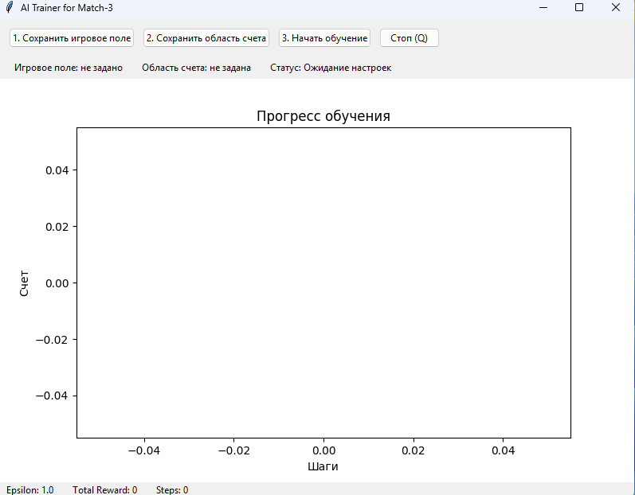
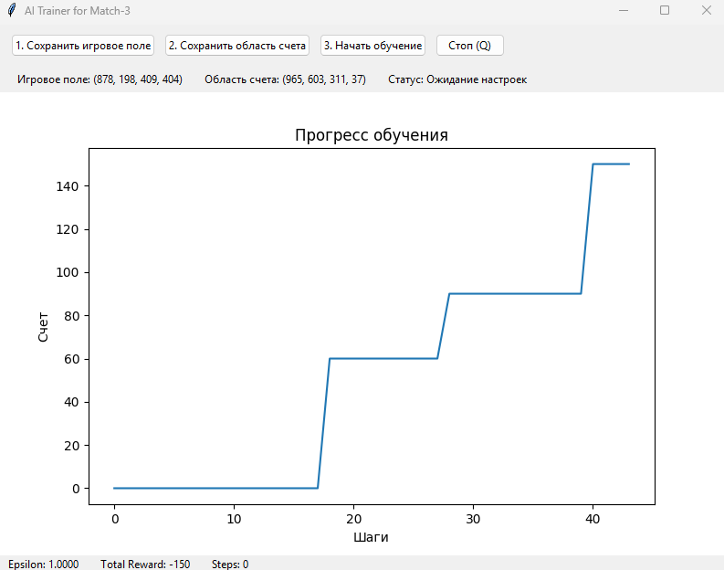

    <h1>🧠 Мой первый проект по обучению ИИ</h1>
    
Привет! Меня зовут Владислав, и это мой первый шаг в мир искусственного интеллекта. Я решил научить нейросеть играть в классическую игру «3 в ряд» — как в Candy Crush!

    <h2>🎯 Что умеет этот проект?</h2>
    
ИИ анализирует, что происходит на экране игры, и отслеживает свою успешность по очкам. Чтобы это работало:

    <ul>
      <li>Запусти игру «3 в ряд» на экране</li>
      <li>Укажи игровое поле и область счёта и нажмите начать обучения</li>
      <li>Наблюдай, как ИИ играет полерно обучается</li>
    </ul>
    <h2>🖼️ Как это выглядит</h2>
    
<strong>Что видит ИИ при запуске:</strong>

    
    
<strong>После распознавания — выделение игрового поля и счёта:</strong>

    
    <h2>⚙️ Технические детали</h2>
    

      Описание: модель классифицирует изображения с помощью сверточной нейросети (CNN). 
      Технологии: Python, TensorFlow, Keras 
      Результаты: текущая точность — 60%
    

  

